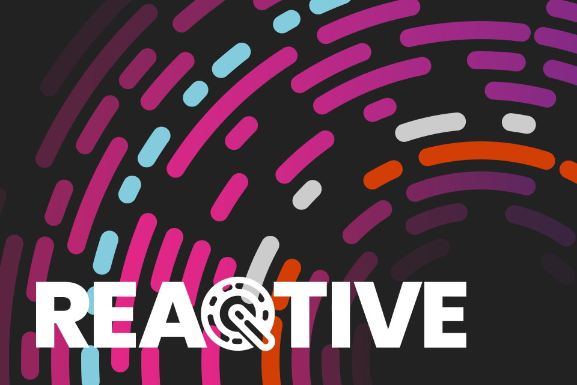

 

# Reaqtive Community Presentations

## See also Reaqtive Creative Assets

The [Reactive Creative Assets](https://github.com/reaqtive/reaqtive-creative-assets) repository contains logos, social media assets, PowerPoint templates and a range of branded backgrounds, which can be used by the community for blogging, presentations, talks etc to help spread the word about, and increase adoption of Reaqtor.

## License

All these creative assets are available under a [Creative Commons Attribution Share Alike 4.0 International](https://creativecommons.org/licenses/by/4.0/) license. With ❤ from [endjin](https://endjin.com)